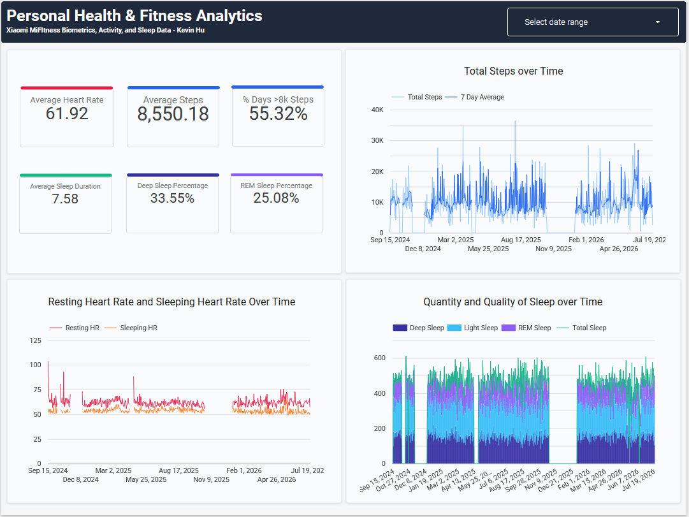

# MiFitness Dashboard

<a href="https://datastudio.google.com/s/mTjOQonZc80" target="_blank">
  
</a>

<a href="https://datastudio.google.com/s/mTjOQonZc80" target="_blank">🔗 View Live Interactive Dashboard on Looker Studio</a>

---

## 📌 Project Overview
I've always enjoyed tracking my steps, sleep, and workouts with my watch, but never had a way to visualize all of the data in a weekly, monthly, or yearly view. I recently found out that you can request a copy of your Xiaomi MiFitness Data, giving me inspiration for this project. This data is pulled from my MiBand 9 and shows almost 2 years of my personal health data. 

An end-to-end data analytics pipeline transforming raw biometric export data from **Xiaomi Mi Fitness** into actionable health intelligence. Raw semi-structured JSON exports are parsed, cleaned, and aggregated in **Google BigQuery** using SQL, then surfaced through an interactive **Looker Studio** executive dashboard tracking cardiovascular strain, sleep architecture, and daily activity habits.

---

## 🛠️ Architecture & Tech Stack
* **Storage & Warehouse:** Google BigQuery
* **Data Transformation & Modeling:** SQL (Common Table Expressions, Window Functions, Date Arrays, JSON Parsing)
* **Visualization Layer:** Google Looker Studio
* **Data Grain:** Daily summary aggregations (`Daily Health Summary`) generated against a continuous calendar spine.

```text
Raw JSON Device Logs ──► BigQuery Ingestion ──► SQL ETL Pipeline ──► Looker Studio Dashboard
(Sleep / HR / Steps)     (Type Parsing / UTC)   (Calendar Spine /    (KPIs, Trends & Stages)
                                                Rolling Averages)
```

---

## 📊 Key Metrics & Visualizations
Frankly, I don't use my watch much outside of steps, sleep, and workouts. As such, most of my KPI scorecards and graphs only focus on these metrics.

---

## ⚙️ Data Engineering & SQL Highlights
### 1. Robust Semi-Structured JSON Parsing & Timezone Handling
Xiaomi exports raw sensor data as JSON strings with Unix timestamps. The extraction layer handles null-safety and converts timestamps directly into the target timezone (`America/Toronto`)

### 2. Continuous Calendar Spine & Rolling Window Metrics
Because I first examined the individual tables (`2 - heart data.sql`, `2 - sleep data.sql`, `2 - steps data.sql`), I had a unique problem to solve when combining them all to my daily health summary, I had to ensure that there was a continuous data array for my graphs to show up properly on Looker/Data Studio. As such, I generated a continuous date array calendar and `LEFT JOIN`ed against the summary tables

---
## 📁 Repository Structure
```
├── README.md
├── docs/
│   └── MiFitness_data_copy_guide.pdf   # Guide on the tables and columns
├── images/
│   ├── Dashboard.png                   # Dashboard preview
│   ├── Dashboard Filtered.png          # Dashboard with a date filter applied
│   └── MiFitness_Dashboard.pdf         # pdf export of the dashboard
└── sql scripts/
    ├── 1 - data cleaning.sql           # JSON extraction & Unix timestamp normalization
    ├── 2 - heart data.sql              # Daily heart rate metrics
    ├── 2 - sleep data.sql              # Sleep stage and bedtime duration parsing
    ├── 2 - steps data.sql              # Steps and activity data
    └── 3 - daily health summary.sql    # Calendar spine join with rolling 7-day averages
```

---
## 🚀 How to Replicate
1. **Google Cloud Platform:** Create a BigQuery dataset and ingest the raw Xiaomi MiFitness `.csv` export dumps
2. **Execute Transformations:** Run the scripts in `/sql scripts` sequentially to build `Fitness Data Cleaned View`, stage-specific tables, and the unified daily reporting table. Save each table in BigQuery
3. **Connect Looker/Data Studio:** Add the output table as a BigQuery data source and map custom aggregations to scorecards, time-series charts, and combo charts

---
## 📄 License & Author

Developed by Kevin Hu  
*Health Informatics & Data Analytics Professional*

📧 [Email Me](mailto:kevzjhu@gmail.com) | 💼 [LinkedIn](https://www.linkedin.com/in/kevinhu77/)
